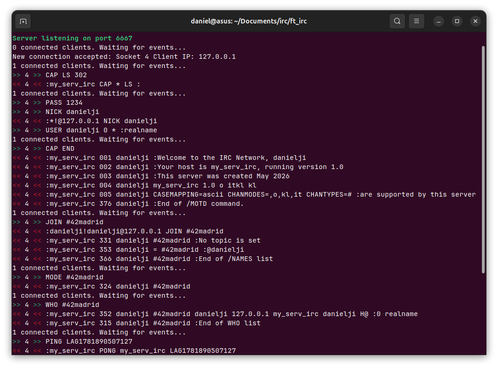

*This project has been created as part of the 42 curriculum by aldiaz-u, danielji, and mparra-s*

# ft_irc



## Description

<!-- Clearly presents the project, including its goal and a brief overview. -->

This project is an IRC server written in C++98 using **Linux sockets** and **non-blocking I/O**. Any client should be able to connect and communicate with it following standard IRC protocols.

### The Linux socket API

> Adapted from [The Linux socket API explained](https://www.youtube.com/watch?v=XXfdzwEsxFk) by Chris Kanich.

Both server and clients perform similar system calls before any connection attempt. When the server is listening, a client first requests a connection with `connect()`  and the server accepts it by calling `accept()`. Once server and client are connected through a socket, they can both send and receive data from each other using `recv` and `send`.

When a client disconnects it sends an `EOF` message, the server reads a message of 0 bytes length and then closes the connection.

```
   SERVER            CLIENT
   ======            ======

 getaddrinfo       getaddrinfo
     ↓                 ↓
   socket            socket
     ↓                 |
    bind               |
     ↓                 |
   listen              |
     ↓                 ↓
   accept <-------- connect
     ↓                 ↓
    recv <---------- send
     ↓                 ↓
    send ----------> recv
     ↓                 ↓
    recv <-- EOF --- close
     ↓
   close
```

### Non-Blocking I/O

The `recv`, `send` and `accept` system calls are blocking. That means the server would block while `recv` waits for more data to come.

This IRC server relies on `poll` to achieve non-blocking I/O operations. `poll` watches file descriptors and tells us when any file descriptor is ready to perform I/O operations. We then only call `recv` when `poll` guarantees the data is already available, so `recv` returns immediately instead of blocking the server.

## Instructions

<!-- Contains any relevant information about compilation, installation, and/or execution. -->

```sh
# Compile:
$ make

# Compile bot:
$ make bonus

# Run:
$ ./ircserv <port> <password>

# Run bot:
$ ./ircserv_bonus

# For example:
$ ./ircserv 6667 1234

# Press Ctrl+C to stop and exit the program:
$ ^C
```

### How to connect using `nc`

You can use [Ncat](https://nmap.org/ncat/) or [Netcat](https://sectools.org/tool/netcat/) to connect to the IRC server. Run `nc` with `-C` option to use CRLF for end of line sequence. Specify the same host and port used in the server. For example:

```sh
nc -C localhost 6667
```

To complete the registration process send the following commands in this order. Replace `<pass>` by the server's password and `<nick>` by any valid nickname of your choice.

```
CAP LS 302
PASS <pass>
NICK <nick>
USER <nick> 0 * :realname
CAP END
```

Upon registration you may now join to channels, send private messages, etc.

```
JOIN #42madrid
PRIVMSG #42madrid :Hello you all!
```

Type `Ctrl`+`C` to quit.

### How to connect using HexChat

[HexChat](https://hexchat.github.io/) is an open source IRC client. It provides a friendly interface to interact with.

When using HexChat you must prefix every command with `/`, (i.e. `/join #42madrid`).

- Open HexChat, fill in **Nick name** and **User name**.
- Press **Add** to add a new network and then press **Edit...**.
- Change `newserver/6697` to the server's IP and port. (For example, `localhost/6667` or `127.0.0.1/6667`).
- Uncheck `Use SSL for all the servers on this network`.
- Set **Login method** to `Default` or `Server password (/PASS password)`.
- Press **Close** to apply the changes and finally click on **Connect**.

## Commands

Clients can send the following commands to the IRC server:

| Command | Description | Example | Reference |
| ------- | ----------- | ------- | --------- |
| `CAP` | Used during user registration for capability negotiation between a server and a client. | `CAP * LS 302` | [CAP](https://modern.ircdocs.horse/#cap-message) |
| `PASS` | Set a connection password. | `PASS 1234` | [PASS](https://modern.ircdocs.horse/#pass-message) |
| `NICK` | Give the client a nickname or change the previous one. | `NICK homer89` | [NICK](https://modern.ircdocs.horse/#nick-message) |
| `USER` | Used at the beginning of a connection to specify the username and realname of a new user. | `USER homer 0 * :Homer Simpson` | [USER](https://modern.ircdocs.horse/#user-message) |
| `PING` | Sent by either clients or servers to check if the other side of the connection is still connected. | `PING LAG1781564777701` | [PING](https://modern.ircdocs.horse/#ping-message) |
| `QUIT` | Terminate a client’s connection to the server. | `QUIT :Gone to evaluate someone's Libft` | [QUIT](https://modern.ircdocs.horse/#quit-message) |
| `JOIN` | Join or create a channel. <sup>[*(notes)*](#join)</sup> | `JOIN #born2code` | [JOIN](https://modern.ircdocs.horse/#join-message) |
| `PART` | Exit from the given channels. | `PART #born2code,#42madrid :Absorbed by the blackhole` | [PART](https://modern.ircdocs.horse/#part-message) |
| `TOPIC` | Change or view the topic of the given channel. <sup>[*(notes)*](#topic)</sup> | `TOPIC #catmemes :Share your favorite cat memes` | [TOPIC](https://modern.ircdocs.horse/#topic-message) |
| `NAMES` | List the nicknames joined to a channel. Channel operators are prefixed with `@`. | `NAMES #42madrid` | [NAMES](https://modern.ircdocs.horse/#names-message) |
| `LIST` | Get a list of channels along with some information about each channel. | `LIST` | [LIST](https://modern.ircdocs.horse/#list-message) |
| `INVITE` | Invite a user to a channel. | `INVITE aldiaz-u #born2code` | [INVITE](https://modern.ircdocs.horse/#invite-message) |
| `KICK` | Remove a user from a channel. | `KICK #born2code danielji :Very noisy user` | [KICK](https://modern.ircdocs.horse/#kick-message) |
| `PRIVMSG` | Send private messages between users or to members of channels. | `PRIVMSG rachel-g :How you doin?` | [PRIVMSG](https://modern.ircdocs.horse/#privmsg-message) |
| `NOTICE` | Send notices between users or to members of channels. | `NOTICE #born2code :Can someone evaluate an Inception?` | [NOTICE](https://modern.ircdocs.horse/#notice-message) |
| `WHO` | Query a list of users from a channel. | `WHO #42madrid` | [WHO](https://modern.ircdocs.horse/#who-message) |
| `MODE` | Set or unset options from a channel. <sup>[*(notes)*](#mode)</sup> | `MODE #mychan +k 12345` | [MODE](https://modern.ircdocs.horse/#mode-message) |

### JOIN

Use `JOIN` to join an existing channel or create a new one. If the specified channel doesn't exist it will be created and you will become a channel operator.

You may specify a list of comma-separated channels.

Provide a password argument if the channel requires it or if you want to create a password-protected channel.

```
JOIN #born2code

JOIN #born2code 1234

JOIN #born2code,#42madrid 1234
```

### TOPIC

If the protected topic mode is set on a channel, clients must have appropriate channel permissions to modify the topic of that channel.

```
TOPIC #catmemes

TOPIC #catmemes :Share your favorite cat memes
```

### MODE

Set (`+`) or unset (`-`) options from a channel. You may combine multiple options and their arguments in one single command. The server should reply with a list of the applied changes, if any.

- `+i`: Set channel to invite-only mode
- `+t`: Only channel operators can modify topic
- `+k`: Set a password to join channel
- `+l`: Set a user limit to a channel
- `+o`: Give operator privileges to a user

```
MODE #mychan

MODE #mychan +k 1234

MODE #mychan +l 100

MODE #mychan +o joey33

MODE #mychan +ikl-t 1234 100
```

### BOT

Run the bot in a different terminal from the server. The bot will join every
public channel available and also create its own `#Omni-bot` channel.

The bot acts as an AI assistant that connects to a public API to answer any
question users ask. Use the `!ask` command followed by your question and the
bot will reply in the same channel, with a response of up to 400 characters.


## Resources
<!-- Classic references related to the topic (documentation, articles, tutorials, etc.),
as well as a description of how AI was used —specifying for which tasks and which parts of the project. -->

- Jack Allnutt, Daniel Oaks, Val Lorentz: [Modern IRC Client Protocol](https://modern.ircdocs.horse/)
- [IRC Protocol Documentation](https://dd.ircdocs.horse/)
- The UChicago χ-Projects: [chirc](http://chi.cs.uchicago.edu/chirc/index.html)
- Chris Kanich: [The Linux socket API explained](https://www.youtube.com/watch?v=XXfdzwEsxFk)
- Brian “Beej Jorgensen” Hall: [Beej's Guide to Network Programming](https://beej.us/guide/bgnet/)

### How AI was used

AI tools were helpful to clarify basic concepts about socket connections and non-blocking operations, as well as to solve bugs we were having trouble with.

Additionaly we asked AI tools how to force system errors to test the server's error handling.
